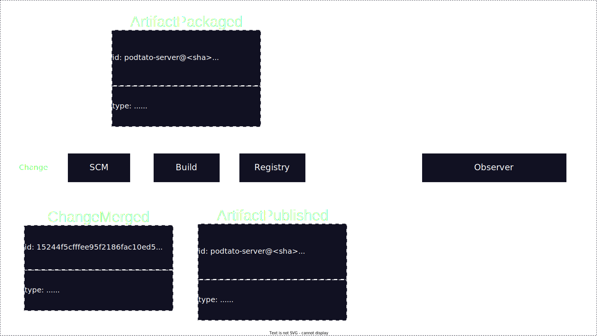
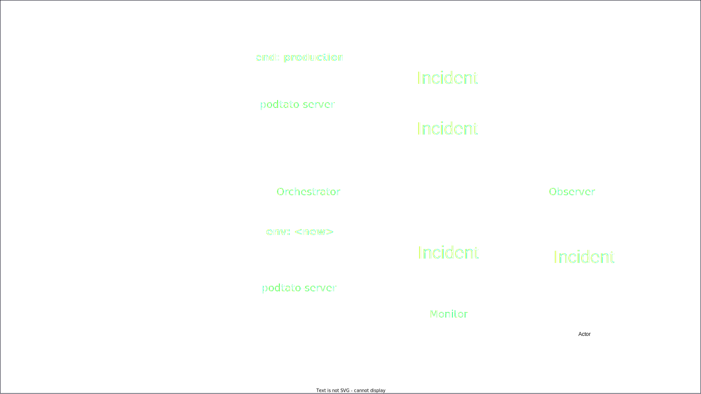
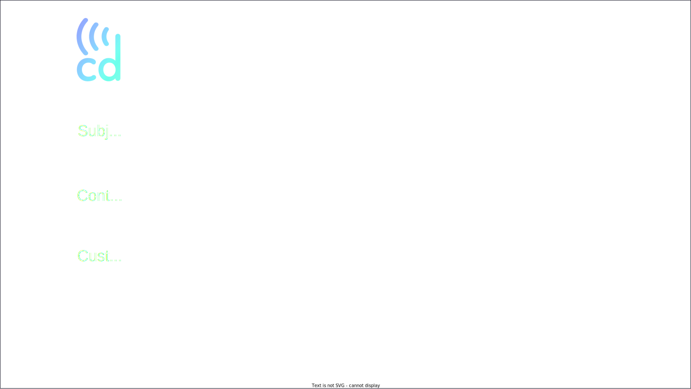

<!-- Uses MARP, see https://marp.app/ -->

<!--
class:
 - lead
 - invert
-->

# OSSEU 2022

#### Building DevOps metrics for your choice of CD tools through CDEvents

---
# A long long time ago

<!-- >>> Erik <<<
Back in October of 2012 I was working in the telecom industry and I had just gotten involved in one of the early CI/CD efforts in my workplace.

My project lead came by to explain the current situation and he said,
"Well, Erik, to start with we make releases every six months, right?
The development of those releases typically start around a year before release, and the releases get verified by the verification teams during the last three months before release."

So, this means developers frequently need to wait ...
-->

---
# A long long time...

<!--
... a long long time, like a few months for their work to be fully tested.
So, if a bug is found, the developers need to make the MOTHER of all context switches to get back into whatever the bug is about. If you're like me and you're having a hard time remembering what you did this morning, imagine remembering what you did eight months ago.

Anyway, my project lead then proclaimed "We need to bring this time, the time from development to verification and release, down from a few months to a few hours."

I remember thinking "going from months to hours seems like a crazy big step!" but I have since been shown over and over again that this step is actually not that crazy!

One factor that really helps taking this step is to understand where our bottlenecks are, and for that we need metrics.

My name is Erik Sternerson...
-->

---
# OSSEU 2022

#### Building DevOps metrics for your choice of CD tools through CDEvents

####

####

#### Andrea Frittoli, IBM. Erik Sternerson, doWhile

<!-- >>> Andrea <<<

...and my name is Andrea Frittoli.
Welcome to Building DevOps metrics for your choice of CD tools through CDEvents

-->

---
<!--
_class:
 - invert
-->

# In this talk

* ## Learn About CDEvents

* ## Learn About DevOps Metrics

* ## How do they fit together

---

# CDEvents

<!-- >>> Erik <<<

Let's first look into what CDEvents is. 
-->

---

# Conceptual: Common language

<!-- 
The conceptual goal of the CDEvents project is to help build a common language for CI/CD and surrounding domains.
-->

---

# Concrete: Spec and SDKs

<!-- 
The concrete goal is to build a specification for events in CI/CD, and to build a set of SDKs that help others send and receive such events.
-->

---

<!-- 
Lets dig in to the spec a bit first. 
-->

---

<!-- 
The CDEvents spec declares a number of events that represents things that may happen in CI/CD, such as a change having been merged, a task having been run or a new version of a service having been deployed.

The spec also defines what data can or must be sent for such events, typically data needed by the receivers of the events.

And finally, as CDEvents is based on CloudEvents, the spec also provides rules and guidelines for how to use the attributes provided by the CloudEvents specs, such as source and subject.
-->

---

<!-- 
Given this spec, we can now work on a set of SDKs for multiple programming languages and platforms.
-->

---

<!-- 
So if we want to send an event such as ServiceDeployed in a language for which we have an SDK, we can get quite a lot of help on the way.
-->

---

<!-- 
Finally, with the SDKs, we can work on integrating CDEvents into new and existing tools and solutions such as your Jenkinses, Argos, Keptns and Tektons, and set up various proof-of-concepts to test out new ideas and help drive the specification forward.
-->

---

<!--
_class:
 - invert
-->

# Wider effort

<!-- And this is a wider effort. -->

* ## CDEvents team

<!-- The spec itself is driven by the CDEvents team, but with plenty of support, input and feedback from the wider community.
-->

* ## Project communities

<!-- Several integrations and proof-of-concepts and at least one of the SDKs thus far have been done wholly or partly outside of the CDEvents project itself, by members of the project communities for several CI/CD tools.
-->

---

# What we want to achieve through CDEvents

<!-- Lastly about CDEvents, I want to just very briefly cover the two main areas that we want to address with our project.

We have covered these desired achievments in way more detail in previous talks, but for the purpose of this talk, our two main goals are...
-->

---

# Interoperability

<!-- First, interoperability, making things work together by having them speak a common language.
-->

---

# Observability

<!-- And second, and the most relevant for this talk, observability, providing directives both on what to send, as well as when to send it.

Through observability comes a great opportunity for building metrics, and the main focus of our talk today are four important DevOps metrics.

Andrea, do you want to tell us a bit about those?
-->

---

# DevOps Metrics

<!-- >>> Andrea <<<

Thanks Erik for the great introduction about CDEvents.

The State of the DevOps Report, published by Puppet, has been looking at
how organization implement DevOps over the years. Already since 2013
the report had identified a set of metrics which describe measurable
outcome of organizations implementing DevOps practices.
-->

---

<!--
_class:
 - invert
-->

# DORA Metrics

* Deployment Frequency
* Lead Time for Changes
* Change Failure Rate
* Time to Restore Service

<!--
The four metrics used by the report are those identified by the DORA (DevOps Research and assessment group.
These metrics span the entire software lifecycle. They do not necessarily cover all aspects of DevOps, and organizations may define other metrics as required.

* Deployment Frequency
* Lead Time for Changes
* Change Failure Rate
* Time to Restore Service

Something that is apparent from this list of metrics is that no single tool will produce the data required to calculate them.

Having a common language like CDEvents spoken by different tools would simplify the analysis of data required to calculate the metrics. Our goal is to foster an ecosystem of tools that will be able to do this for systems that can produce CDEvents.

Organizations will be able then to switch one of their tools, or add a new one, and as long as it supports CDEvents, metrics will keep working.
-->

---

# Metrics through CDEvents

<!-- >>> Erik <<<
Ok, with that excellent recap from Andrea on the four metrics we are
talking about today, lets move on to looking at how CDEvents can help
establish these metrics.
-->

---

# Deployment Frequency

<!--
The first one, which may be the most straightforward one, is Deployment Frequency.
-->

---

<!-- Say that we have this pretty simple setup with an orchestrator helping us deploy our application to an environment.

This orchestrator could be many things, for instance kubectl controlled via Tekton, or some other DevOps automation tools like ArgoCD or Spinnaker or Keptn.
-->

---

<!-- 
Anyway, say that we have a new version of our application coming in.

We want to upgrade our existing deployment, and maybe we've also made a configuration change to state that we want an additional deployment in a new environment. 
-->

---

<!--
In CDEvents, we have two events to cover both these cases, ServiceUpgraded and ServiceDeployed.
-->

---

<!-- 
Given that the events state both what was deployed or upgraded, and to what new version, and to what environment, these events are sufficient for an observer to be able to detect how often new versions are deployed, and would thus be able to produce the Deployment Frequency metric.
-->

---

# Lead Time for Changes

<!-- >>> Erik <<<
Next, up is Lead Time for Changes. For this metric, we need data that spans all the way from source code to deplyoment.
-->

---

<!--
We'll start with a change.
-->

---

<!--
This change goes into our SCM solution, whichever one we are using, it gets reviewed
and eventually merged. This is where the clock starts ticking for our lead time.
This is also where our first important even is sent, ChangeMerged, which contains
the repository and sha corresponding to the merge.
There could of course be multiple repositories and multiple changes involved,
but for simplicity we are looking at single-repo, single-change.
-->

---

<!--
Next, the build system does its stuff and spits out an artifact based on the change we just saw.
Connected to this, an ArtifactPackaged event is produced informing the world that this new
artifact or image or deployment package or similar exists.
-->

---

<!--
But just the fact that the package exists doesn't mean anyone else can get it. It needs to be pushed
to a repository, and when that happens another event is sent, called ArtifactPublished.
-->

---

<!--
And finally, once the artifact is published and available, we can pick it up and deploy it,
taking us to the end of our change-to-release pipeline.
-->

---

<!--
So with these events, we have what we need for an observer to be able to calculate the
Lead-time-for-changes metric.

But enough slides, let's look at something live. Over to you Andrea.
-->

---

# Demo

<!-- >>> Andrea <<<
-->

---

# Change Failure Rate

<!-- >>> Erik <<<
The next metric, Change Failure Rate, is an interesting one from an events perspective, so lets look into that.
-->

---

# # Deployments / # Incidents

<!--
This metric can be simplified as the number of deployments we have over the number of incidents that occur for these deployments.
-->

---

# Incidents

<!--
Counting incidents is a bit more involved.
-->

---
<!--
_class:
 - invert
-->

# What can cause an incident?

<!--
First of all, incidents may have many different causes.
-->

* ## Application error (bug!)

<!--
It could be a bug in the application or service we are deploying.
-->

* ## Configuration error

<!--
It could be a mistake in the configuration of the application.
-->

* ## Environment error

<!--
It could also be something entirely unrelated to the application itself,such as a network outage or other type of environment errors.
-->

* ## ...

<!--
And the list of causes doesn't stop there.
-->

---
<!--
_class:
 - invert
-->

# Who can discover an incident?

<!--
Given the variety of causes of incidents, there will also be many different sources that can discover these issues.
-->

* ## Orchestrator

<!--
The system that deploys your application may notice that it doesn't come up properly after deployment.
-->

* ## Monitoring system

<!--
A monitoring system may detect that your application har degraded performance
-->

* ## Application itself

<!--
Of course the application itself may discover that it is not doing well
-->

* ## Users / DevOps team

<!--
There may even be manual reports by users or some operations team, maybe into a bugtracker or similar.

Given that we have so many possible sources, what can should be done when an incident is discovered?
-->

---

# Send an Incident event!

<!--
We send an Incident event!

Now, this event type is new for us, in fact it hasn't formally made it into the spec yet, but we have some prior art which Andrea will mention a bit later.
-->

---

<!--
Anyway, given the same deployment we saw before, with an orchestrator and this time also a monitor (like Prometheus)/
-->

---

<!--
We could have Incidents reported by the orchestrator ...
-->

---

<!--
... by the monitoring system ...
-->

---

<!--
... and by the application itself ...
-->

---

<!--
... and from users or the operations team.
-->

---

<!--
But all of these could be seen by an observer which could then determine the total number of incidents and produce the desired metric.
-->

---

# Time to Restore Service

---
<!--
_class:
 - invert
-->

# What can restore the service?

* ## A rollback or deployment of a newer version
* ## Configuration change (e.g. scaling)
* ## A change to an external dependency

<!--
A service degradation may be solved in a number of ways:
- a rollback or the deployment of a newer version
- scaling, horizontally or vertically
- a change external to the system that suffered the degradation (another microservice, networking issues, etc)

As mentioned, incident events are not part of CDEvents yet. Given the number of possible different scenarios, having dedicated incident and incident resolution events is required to calculate the time to restore service metric.
Data The environment and the service identifiers and the version deployed must be part of all incident resolution events, along with the original incident ID.
The time to restore service may be or may be not associated with a change in the system, thus the related data will be optional in the events.
-->
---

# Prior art: Keptn Application Lifecycle Events

<!--
Keptn provides abstractions, automation and events related to SLIs, SLOs and
problems. That enables generating events valuable for tracking the time to
restore service metric. The CDEvents project is evaluating whether to adopt
the Keptn model for its own application lifecycle type of events.
-->

---

# Who generate the incident resolution events

<!--
Who generate the incident resolution events?
Different systems may send events about the same incident resolution, with different amount of context. We plan to allow multiple events in this area that can be collated later by the observer.
-->

---

<!--
Events from the orchestrator.

For instance, when using Knative, a service may be scaled up and down based on metrics. A metric degradation that leads to scaling up could generate the incident event, and the Knative autoscaler could send CDEvents about the incident resolution once the scaling up is done.
-->

---

<!--
Events from the monitoring system
-->

---

<!--
Events from the application or a human

In many instances the resolution may not be automated at all. The CDEvents SDKs may be used to provide a workflow for engineers to record the data
required to keep track of the "time to restore service". This could be integrated for instance in the issue tracking system of choice.
-->

---

# Key takeaways

<!-- >>> Erik <<<

We're nearing the end of the talk, so let's wrap up with a few key takeaways.
-->

---

# Metrics are tricky

<!--
As we've talked about, metrics may require several different pieces of information, and these pieces may come from many different sources ...
-->

---

# Metrics are tricky

<!--
... so bringing all this together to produce the desired metrics can be really tricky.
-->

---

# A common language helps!

<!--
Having then a common language and a standardized way of distributing information in this common language can really help ...
-->

---

# A common language helps!

<!--
... and this is the aim of the CDEvents project.
-->

---

# A call to action

<!--
And to make this possible, the CDEvents project and community can
really benefit from your involvement, in anything ranging from giving
feedback and providing your use cases, to working with us on the spec
or developing SDKs and integrations.
-->

---

# cdevents.dev

<!--
You can find our work, and how to get involved, on cdevents.dev
-->

---

# Thank you!

<!--
With that, we'd like to thank you all for attending the talk,
I've been Erik Sternerson, this is Andrea Frittoli, and we'd now
like to open the floor for questions.
-->

---
<!--
_footer: 'OSSEU | 16.09.2022'
-->

# Questions?

##
##
##
##
##

#### Andrea Frittoli, IBM. Erik Sternerson, doWhile

---

# Extra slides

---

# On top of CloudEvents

<!--
CDEvents is built on top of CloudEvents. CloudEvents is a project from the Cloud-Native computing
foundation for describing event data in a common way, but what does this mean for CDEvents?
-->

---

<!--
Starting with CDEvents, we could see an event as memo we want to distribute.
-->

---

<!--
In this memo, we put information about the subject of the memo, for instance an
artifact we have built. We also put some information about the context in which
it was built, for instance in a pipeline. And finally, we have space for
custom data, which could be any additional information someone else wants to
include in the memo.
-->

---

<!--
CloudEvents provides the envelope or package for this memo. We transfer some
parts of the memo to the back of the envelope as "sender information" which
can be used to route the envelope, and then we stuff the memo in the envelope
and seal it.
-->

---

<!--
CloudEvents helps us select the right type of envelope, write the right style
of address and also actually ships the envelope to wherever we ask it to. It's
a bit like having our own post office. Regardless of whether we want to send over
HTTP, AMPQ, Kafka or something else, chances are CloudEvents knows how to do it.

This means we can focus on just defining the payload, and not have to worry about
the transport.
-->