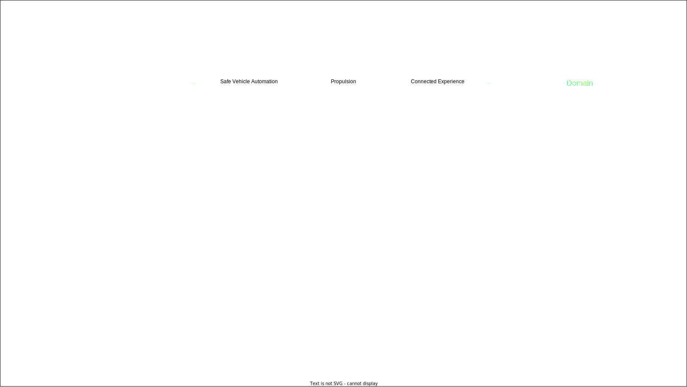
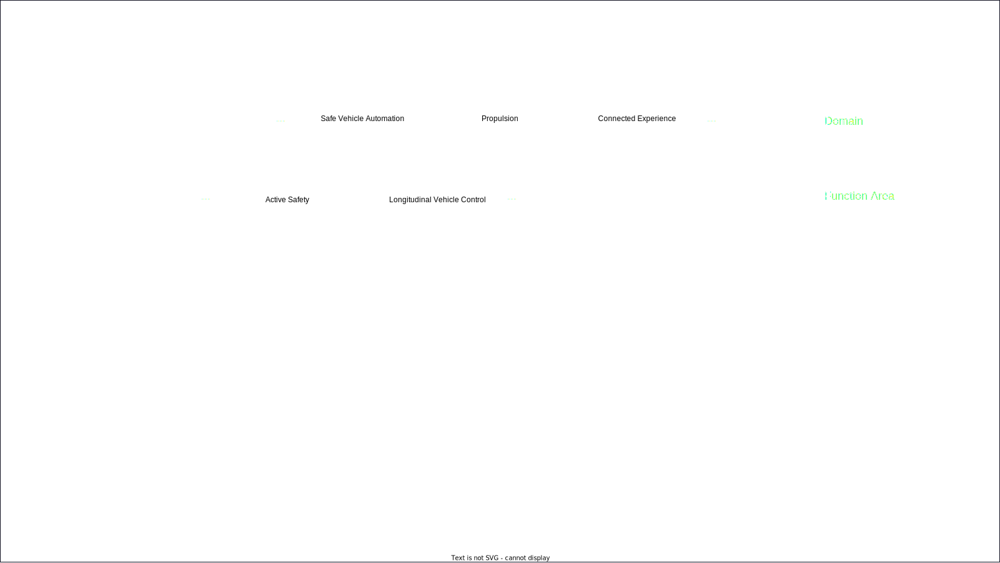
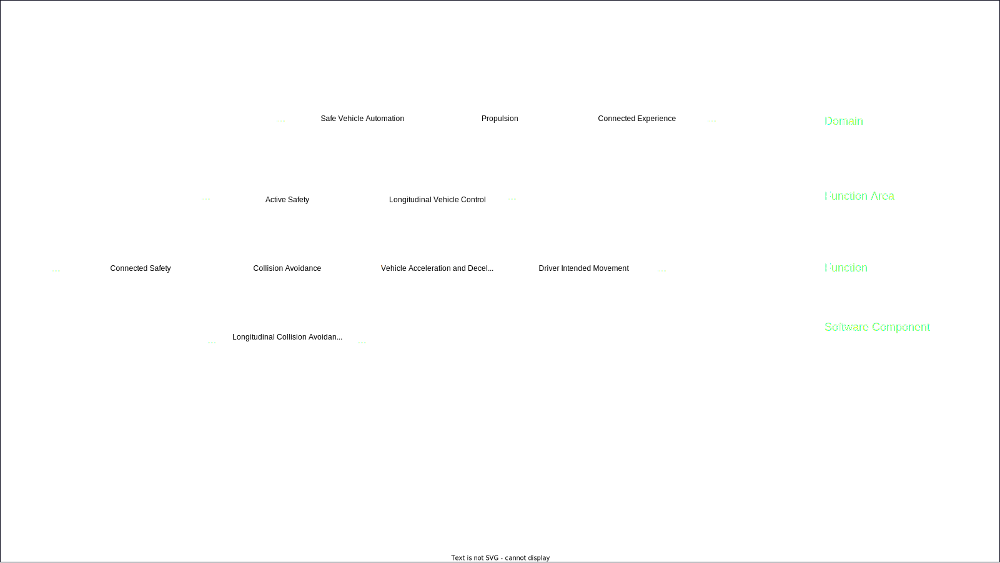
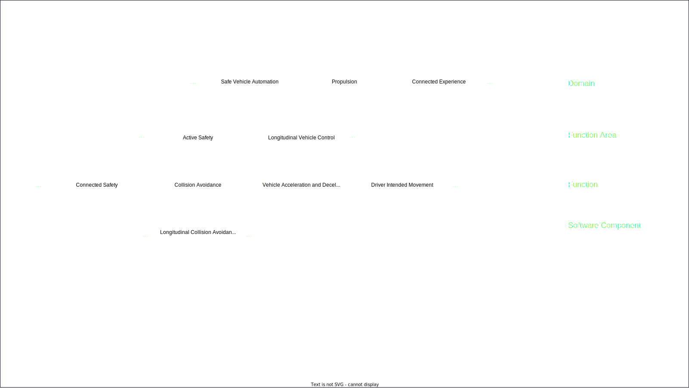
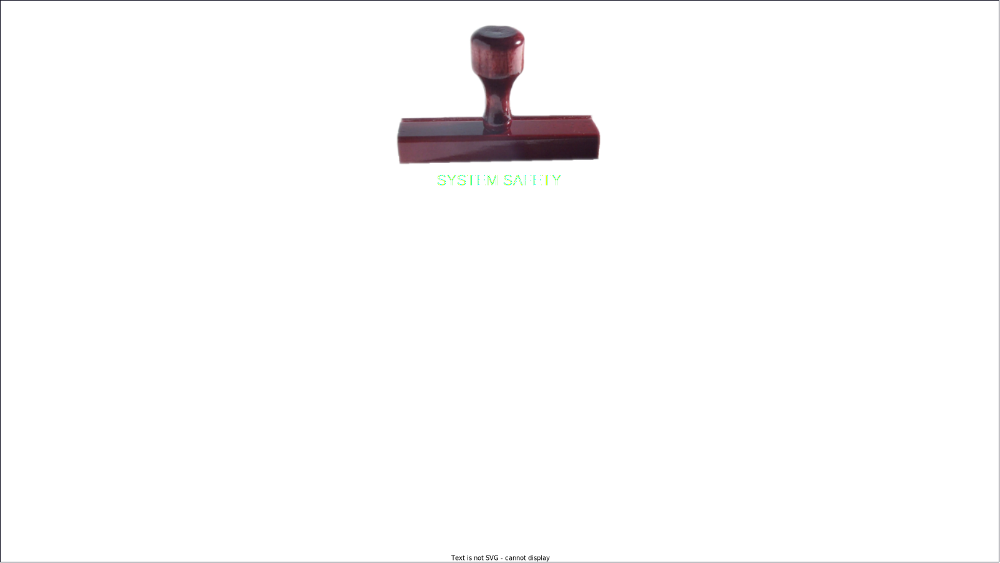
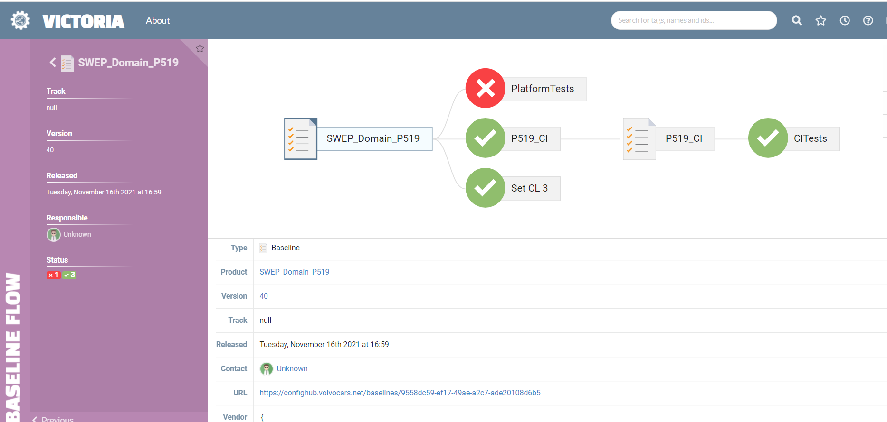

<!-- Uses MARP, see https://marp.app/ -->

<!--
class:
 - lead
 - invert
-->

# CDEventsCon

#### CI/CD for Autonomous Drive and Other Complex Systems

---
# "Nobody knows how to build a car..."

<!-- So I had just come out of this meeting where we were discussing something related to ... probably road safety or something. Anyway, I was chatting to Sabina, one of our test strategy experts, and the topic of variant handling came up because I had recently learned that with all the variants of all the components for different regions and  fuel sources and vehicle types etc. there were actually 4.2 BILLION different ways to combine things into a vehicle.

I was asking who decides what combinations of variants should be verified, because there is no way we are verifying all of them, and Sabina looked at me and said: "Erik, nobody knows how to build a car"

I remember thinking "That cannot be true, we are building cars every day", and I kind of categorized her statement as an exaggeration for effect and went on with my day.

Much much later, I have a came to a new understanding of "Nobody can build a car". It is not that it is impossible to build a car, it is that ... -->

---

<!-- ... no SINGLE PERSON knows how to build a whole car, with all the parts and all the software and all the configuration that goes into a modern vehicle. It's beyond anyones capacity to keep track of everything. So, a car gets build through collaboration, and collaboration requires communication.
-->

---
# CDEventsCon

#### CI/CD for Autonomous Drive and Other Complex Systems

##### (especially using events)

####

####

#### Erik Sternerson, doWhile

---

<!-- These are the kind of projects that occupy my daily work, specifically when it comes to enabling continuous integration and continuous delivery of software and hardware into these types of vehicles.
-->

---
<!--
_class:
 - invert
-->

# In this talk
<!-- Comment
-->

* ## CD/CD for autonomous drive

* ## Transitioning to events

* ## Future

---

# Building Complex Systems

<!-- Systems can be complex for several reasons. They may have individual parts that are very advanced, for instance with complex algorithms or complex data structures. Or they can be complex because they have many parts that need to work together. The types of systems this talk will focus on has a little bit of both.
-->

---

<!-- So, we want to build, package and release and autonomus drive vehicle. Just selecting the latest and greatest of all harware and software components and putting everything together is very likely not going to work. 
Some components will not work that well together and it will be really hard to figure out which ones don't. 
Instead, we need to divide the work into smaller pieces.
-->

---

<!-- We'll start by defining a set of domains. These domains are pretty abstract groups of functionalty, and typically have on the order of 15-30 embedded computers and 30-60 developments teams under them. 

One such domain could be "Safe Vehicle Automation", ensuring that not only can the vehicle move, but it can do so without putting the driver or itself in danger.
-->

---

<!-- Next, we break each domain down into functionality areas. Now we are getting a bit more concrete, but the areas are still quite large. 2-6 embedded computers, 4-12 teams.
-->

---

<!-- So, we continue to break things down into functions. Here we get to something a bit more manageable, maybe 1 or 2 embedded computers, and 2-4 teams.
-->

---

<!-- And finally we get to an individual software component that implements one part of a function and goes on one embedded computer, typically developed by one development team. If we stop here, things still look reasonably manageable but unfortunately we have to also consider...
-->

---

<!-- ...that our software component needs to interact with other components in other functions in other domains.

So this means we cannot fully test our software component until we have most or all other components in the vehicle as well. But I said just a few minutes ago that we cannot just combine all the components together and test them, so we need to find another way...
-->

---

# Integrate

<!-- What we want to be able to do is to first take a small composition or subset of components, software and hardware, integrate them together and verify them, to smoke out the easy-to-discover issues. Then, we integrate this smaller composition with other compositions into a bigger composition and verify that. So on and so forth untill we have all the components in the same composition.
-->

---

<!-- Essentially, we will end up with something similar to the breakdown we just looked at, but in a sense of "building up" rather than "breaking down".
-->

---

# Continuously

<!-- So, we are integrating components into larger and larger compositions to be able to verify them in a sensible way, but do we want to do that only once or twice a month? Of course not, we want to do it as often as possible, for two reasons. 

One, the less time a developer has to wait for the verification of their change, the easier it will be for them to fix any issues that come up. 

Two, the fewer changes we introduce in any new composition we verify, the easier it will be to understand what changes may have contributed to the issue.

Ideally, we would start the process whenever there is a change anywhere, but we may have to settle for just doing it continuously using the resources we have.
-->

---

# Continuous ... Integration ... ?

<!-- So, the somewhat unfortunate term at least my part of the industry is using for this process is Continous Integration, and its unfortunate because it conflicts with the more official definition of the Continous Integration.
-->

---

# CDF: Continuous Integration

#### "the practice of merging all developer working copies to a shared mainline several times a day"

<!-- The CD Foundation defines Continuous Integration as "the practice of merging all developer working copies to a shared mainline several times a day", which is definitely related to what we are doing, but most our work starts after this "mainline" has been built and delievered. -->

---

# "Our" Continuous Integration

#### "frequently and iteratively integrate components together in increasingly complex compositions"

<!-- If I was to try to provide a definition for "Our" Continuous Integration, it would be something like

"frequently and iteratively integrate components together in increasingly complex compositions"
-->

---

<!-- I think it would be fair to say that the official definition of CI and our definition of CI both have similar goals, but exist on different "levels". And thus have somewhat different activities to run and problems to overcome.

With this in mind, we are now ready to start talking about events.
-->

---

# Before events

<!-- To bring you on the journey from no events to events, I want to start in the early days before we used events in any way. -->

---
<!--
_class:
 - invert
-->

# Before events

<!-- While we had a bit of automation in place already, not using events lead to a few inefficiencies of which I want to select three major ones for this talk. Let's list them now and go through them one by one later.-->

* ## Releases => File + e-mail

<!-- First, releases were pretty manual and only announced to those you knew wanted to know about it.   -->

* ## Pipelines => Jenkins server per team

<!-- Second, pipelines typically started and ended in the same team, and typically on a quite overloaded Jenkins server -->

* ## Verification results => "Known by the team"

<!-- And finally, the way to find the current state of verification was to ask all the teams responsible for producing verification results. -->

---

# Enter events

<!-- So, let's solve these issues one by one, using events. -->

---

# First: Infrastructure

<!-- Before we start sending events, we need a little bit of infrastructure. -->

---
<!--
_class:
 - invert
-->

# Infrastructure

<!-- When we got started, we put three things in place -->

* ## A vocabulary (created/updated)

<!-- Hard to collaborate using events if everyone has their own event definitions, which NOT incidentally is part of the reasone we are all here in the first place! Go CDEvents! Anyway, we came up with a first simple vocabulary ourselves where events either create or update an object in a database. -->

* ## A transport (RabbitMQ)

<!-- Also hard to collaborate using events if nobody but you know they exist. We set up a RabbitMQ instance. -->

* ## A triggering system (we DIYed it!)

<!-- This last past is not strictly necessary, but we decided to go for one. This is a system that matches events on the transport against a set of user-defined filters. When there is a match, the action connected to the filter is invoked. More on that later. -->

---

# Releases

<!-- Time solve our first issue, which is letting others know we have made a release. -->

---

<!--
_class:
 - invert
-->

# The release event

<!-- With the infrastructure in place, we can start announcing releases, and we try to include enough information in the event for other systems to be able to not only know that there is a new release of a component or composition, but also to be able to download and use it. -->

- ## Release identifier (UUID)

- ## Release version

- ## File location

---

<!-- With the release events, new versions of each of the components and compositions here can be 
-->

---

# Pipelines

<!-- Next we move on to pipelines -->

---

<!--
_class:
 - invert
-->

# The activity event

<!-- With activities in a pipeline, we are mainly interested in what activity we ran and in what context. -->

- ## Activity name

- ## Chain ID

- ## Result

---

# Verification results

<!-- Finally we come to one of my favorite topics, having worked in the test automation domain for over a decade: How to make verification results meaningful. -->

---

<!--
_class:
 - invert
-->

# The confidence label event

<!-- We introduce a concept called a confidence label. Actually, when I say "introduce" it would be more fair to say "stole from Eiffel", so this concept may make an appearance in the Eiffel talk from Emil later this afternoon. -->

- ## Release reference

- ## Confidence Label

- ## Result

- ## Links to verification

---

# Hang on ... "confidence label"?

<!-- I think the confidence label concept is way more helpful than it may seem at first glance, so it's worth looking into a little bit more. -->

---

<!-- I think my favorite way to look at a confidence label is as a stamp. The label applied by the stamp is something that states something meaningful about our confidence in the quality of the release we stamp the label on.
-->

---

<!-- There will be many different stamps with many different labels, and each component or composition can have labels that are unique to them or shared with others.
-->

---

<!-- We then have one pad of green ink and one pad of red ink, so we can attach positive or negative confidence.
-->

---

<!-- With this, we can go bananas in our component and compositions structure and 
-->

---

<!--
_class:
 - invert
-->

# Confidence labels

<!-- There are a few reasons I think confidence labels are so powerful -->

* ## Encourages teams to plan and communicate quality

<!-- First, having to put meaningful labels on what automated and manual verification actvities actually verify becomes a powerful tool for structure within a team or department, and for communication between teams and departments. -->

* ## "All verification done" => "The quality I need"

<!-- Second, with the communication  -->

---

# Events: What do we gain?

<!-- Let's look at some benefits we got from using events. -->

---

# Automation without centralization

<!-- With events, and especially with a shared vocabulary, we don't need to push or force everyone to use the same CI/CD tools, we only need for them to send events. So, teams can chose the CI/CD tools that work for best for their use cases. -->

---

# Observability

<!-- With these events, we get high observability of what is happening in the process, even if we have no idea where that part of the process is being run. -->

---

<!-- This is one use case for observability, called "Follow your commit", which allows you to track all the verification and compositioning your code changes or release has been subjected to.
-->

---

# Collaboration without causation

<!-- And with this observability comes opportunities to go beyond just seeing what is going on, but actually take automated actions based on events produced by someone else. Way better than waiting for an e-mail! -->

---
<!--
_class:
 - invert
-->

# What will be better with CDEvents

<!-- As we are at CDEventsCon today, I would like to connect back to the work done by the CDEvents project and how it will benefit us going forward. -->

* ## Glue code => Interoperability

<!-- We've spend quite a lot of time writing various kinds of glue code to make existing CI/CD tools trigger on and produce events. The CDEvents project actively work with making the CDEvents specification a first-class member of many of these tools, which mean they will work together out of the box.  -->

* ## Detours => Proper path

<!-- In "our" CI, we chose a pretty naive approach to our first event vocabulary, and we've since needed to re-write this vocabulary a few times. In CDEvents, from what I've seen, the level of discussions and experience of the people involved, we won't see any such radical re-writes, the spec is already on the proper path.-->

---

# Key takeaways

---

# CI/CD is used outside of code and cloud

---

# Complex / Concrete / Shared

---

# Working on shared solutions

---

# Thank you!

---
<!--
_footer: 'CDEventsCon | 17.05.2022'
-->

# Questions?

##
##
##
##
##

#### Erik Sternerson

###### doWhile / Volvo Cars / Volvo Autonomous Solutions
