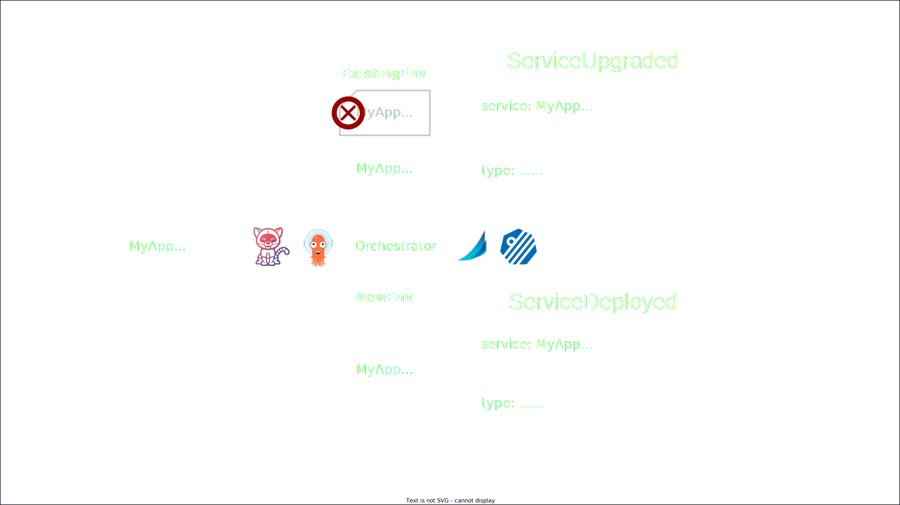
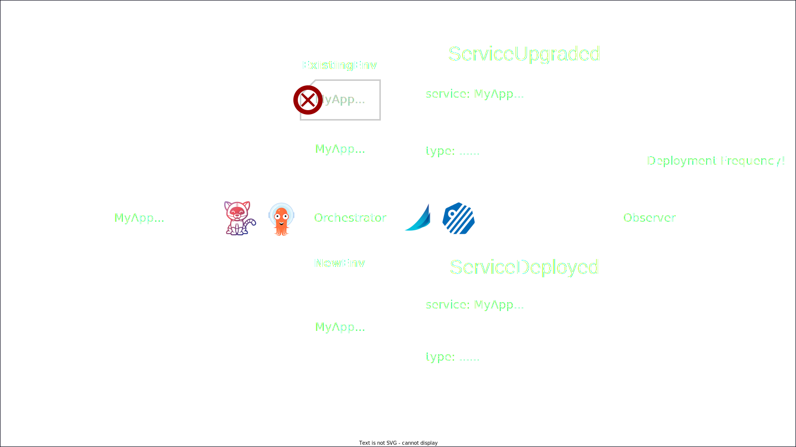
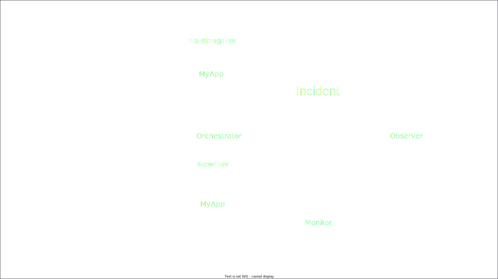
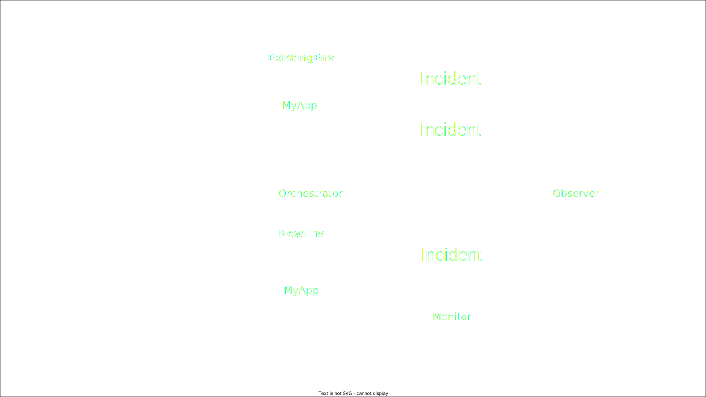

<!-- Uses MARP, see https://marp.app/ -->

<!--
class:
 - lead
 - invert
-->

# Copy the following slides into the main presentation

---

# Metrics through CDEvents

<!-- Ok, with that excellent recap from Andrea on the four metrics we are
talking about today, lets move on to looking at how CDEvents can help 
establish these metrics. -->

---

# Deployment Frequency

<!-- The first one, which may be the most straightforward one, 
is Deployment Frequency.
-->

---

<!--  -->

---

<!--  -->

---

<!--  -->

---

<!--  -->

---

# Change Failure Rate

<!-- The next metric, Change Failure Rate, is an interesting one from an events
perspective, so lets look into that.
-->

---

# # Deployments / # Incidents

<!-- As Andrea mentioned before, this metric can be simplified as the number of
deployments we have over the number of incidents that occur. -->

---

<!-- Counting he number of deployments is actually pretty straightforward 
using the  ServiceDeployed and ServiceUpgraded events we looked at earlier.

Not much to worry about there, so lets have a look at incidents.
 -->

---

# Incidents

<!-- TODO: Does Andrea cover this? -->

---
<!--
_class:
 - invert
-->

# What can cause an incident?

* ## Application error (bug!)

* ## Configuration error

* ## Environment error

* ## ...

---
<!--
_class:
 - invert
-->

# Who can discover an incident?

* ## Orchestrator

* ## Monitoring system

* ## Application itself

* ## Users / DevOps team

* ## ...

---

# Send an Incident event!

---

<!--  -->

---

<!--  -->

---

<!--  -->

---

<!--  -->

---

<!--  -->