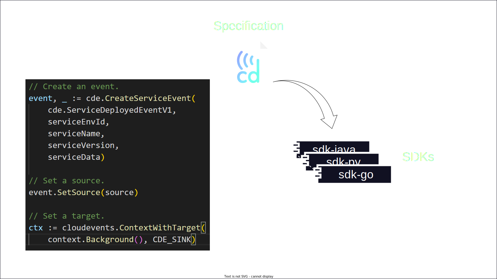
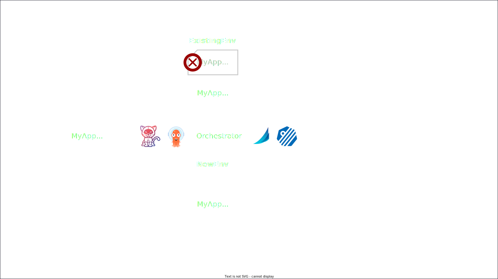
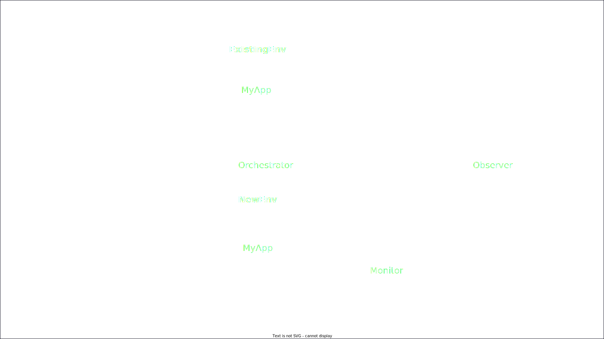
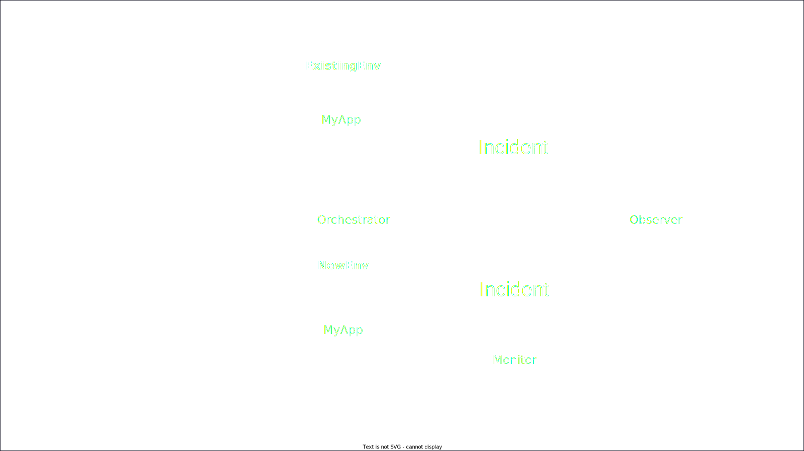
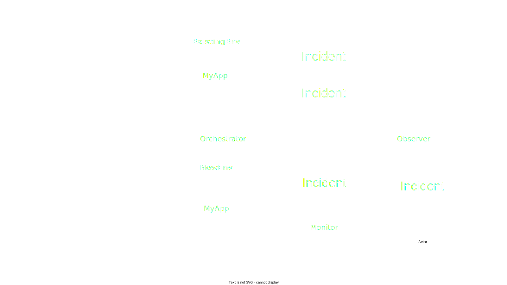

<!-- Uses MARP, see https://marp.app/ -->

<!--
class:
 - lead
 - invert
-->

# cdCon 2022

#### Building DevOps metrics for your choice of CD tools through CDEvents

---
# A long long time ago

<!-- Notes
Erik

In October of 2012 I was working in the telecom industry and I had just gotten
involved in one of the early CI/CD efforts in my workplace.

I got my manager to explain the current situation and he said, "Well, Erik, to
start with we make releases every six months, right? The development of those
releases typically start around a year before release, and the releases get
verified by the verification teams during the last three months before release."
-->

---
# A long long time...

<!-- Notes

So, this means developers frequently need to wait a few months for their work to
be fully tested. And, of course, it is unlikely that whatever they are working
on right now is directly related to what is being verified by the verification
team. If a bug is discovered, developers need to make the mother of all
mental context switches to find and fix the bug. Not at all good.

My manager then proclaimed "We need to bring this time, the time from
development to verification and release, down from a few months to a few hours."

I remember thinking "going from months to hours seems like a crazy big step!"
but I have since been shown over and over again that this step is actually not
that crazy!

One factor that really helps taking this step is to understand where our
bottlenecks are, and for that we need metrics.

My name is Erik Sternerson...
-->

---
# cdCon 2022

#### Building DevOps metrics for your choice of CD tools through CDEvents

####

####

#### Andrea Frittoli, IBM. Erik Sternerson, doWhile

---
<!--
_class:
 - invert
-->

# In this talk
<!-- Comment
-->

<!-- Notes
Andrea
-->

* ## Learn About CDEvents

* ## Learn About DevOps Metrics

* ## How do they fit together

---

# CDEvents

<!-- Let's first look into what CDEvents is. -->

---

# Conceptual: Common language

<!-- The conceptual goal of the CDEvents project is to help build a common
language for CI/CD and surrounding domains.

-->

---

<!--
_class:
 - invert
-->

# Wider effort

<!-- So I set "help build" just now, and that is because this it is not only
CDEvents involved in this work. -->

* ## CDF SIG Interoperability

<!-- The Interoperability special interests group of the Continuous Delivery
foundation can probably be seen as the "driver" of establishing this common
language.

This group does a lot of work defining and establishing terms for
similar concepts across the CI/CD ecosystem, and a lot of these terms pop up in
the CDEvents project in one way or another.
 -->

* ## CDF SIG Events

<!-- The Events special interest group spawned out of the interoperability
group in late 2020 as a workgroup focusing specifically on a
vocabulary for events in CI/CD.

It became a full SIG about a year later, and is the root of...
 -->

---

# CDEvents

<!-- The CDEvents project, and its more concrete goal: -->

---

# Concrete: Spec and SDKs

<!-- To build a specification for events in CI/CD, and to build a set of SDKs
that help others send and receive such events.
-->

---

<!-- Lets dig in to the spec a bit first. -->

---

<!-- The CDEvents spec declares a number of events that represents things that
may happen in CI/CD, such as a change having been merged, a task having been
run or a new version of a service having been deployed.

The spec also defines what data can or must be sent for such events, typically
data needed by the receivers of the events.

And finally, as CDEvents is based on CloudEvents, the spec also provides
rules and guidelines for how to use the attributes provided by the CloudEvents
specs, such as source and subject.
 -->

---

<!-- Given this spec, we can now work on a set of SDKs for multiple
programming languages and platforms. -->

---

<!-- So if we want to send an event such as ServiceDeployed in a language
for which we have an SDK, we can get quite a lot of help on the way. -->

---

<!-- Finally, with the SDKs, we can work on integrating CDEvents into
new and existing tools and solutions such as your Jenkinses, Argos,
Keptns and Tektons, and set up various proof-of-concepts
to test out new ideas and help drive the specification forward. -->

---

<!--
_class:
 - invert
-->

# Wider effort (again)

<!-- And this AGAIN is a wider effort. -->

* ## CDEvents team

<!-- The spec itself is driven by the CDEvents team, but with plenty of
support, input and feedback from the wider community. -->

* ## Project communities

<!-- Several integrations and proof-of-concepts and at least one of the SDKs
thus far have been done wholly or partly outside of the CDEvents project itself,
by members of the community for the projects  -->

---

# CDEvents' goals

<!-- Lastly about CDEvents, I want to just very briefly cover the two main
areas that we want to address with our project. We have covered these goals
in way more detail in previous talks, but for the purpose of this talk,
our two main goals are... -->

---

# Interoperability

<!-- First, interoperability, making things work together by having
them speak a common language. -->

---

# Observability

<!-- And second, and the most relevant for this talk, observability,
providing both directives on what to send, as well as when to send it.

Through observability comes a great opportunity for building metrics,
and the main focus today is DevOps metrics. Andrea, do you want to
tell us a bit about those? -->

---

# DevOps Metrics

<!-- TODO
A couple of slides
- Intro to DevOps metrics, high performing teams, measuring performance
- Specifically, DORA metrics
-->

<!-- Notes
Thanks Erik for the great introduction about CDEvents.

The State of the DevOps Report, published by Puppet, has been looking at
how organization implement DevOps over the years. Already since 2013
the report had identified a set of metrics which describe measurable
outcome of organizations implementing DevOps practices.

Andrea
-->

---

<!--
_class:
 - invert
-->

# DORA Metrics

* Deployment Frequency
* Lead Time for Changes
* Change Failure Rate
* Time to Restore Service

<!-- Notes

The four metrics used by the report are those identified by the DORA group.
These metrics span the entire software lifecycle. They do not necessarily
cover all aspects of DevOps, and organizations may define other metrics as
required. Something that is apparent from this list of metrics is that no
single tool will produce the data required to calculate them.

Having a common language like CDEvents spoken by different tools would
simplify the analysis of data required to calculate the metrics.
Our goal is to foster an ecosystem of tools that will be able to do this
for systems that can produce CDEvents.

[TBD] Plug in new tools. Let each tool focus on one thing it does well.

Andrea
-->

---

# Metrics through CDEvents

<!--TODO
-->

<!-- Notes

Andrea: Let's now dive into each metric, to see which CDEvent types and data can
be used to produce the data required.

EriK: Ok, with that excellent recap from Andrea on the four metrics we are
talking about today, lets move on to looking at how CDEvents can help
establish these metrics.

Erik or Andrea ^_^
-->

---

# Deployment Frequency

<!-- Notes
Erik: The first one, which may be the most straightforward one,
is Deployment Frequency.

Andrea's earlier notes:
Let's take a few examples:
- kubectl or another deployment tool in a Tekton Task
- gitops tool like ArgoCD and Flux
- spinnaker
- keptn

The relevant data here is:
- environment (deployment event)
- artifact name (deployment event)

Erik
-->

---

<!-- Say that we have this pretty simple setup with an orchestrator helping us
deploy our application to an environmnt.

This orchestrator could be many things, for instance kubectl controlled via Tekton,
or some other DevOps automation tools like ArgoCD and Keptn, or maybe Spinnaker.
 -->

---

<!-- Anyway, say that we have a new version of our application coming in.

We want to upgrade our existing deployment, and maybe we've also made a 
configuration change to state that we want an additional deployment
in a new environment. -->

---

<!-- In CDEvents, we have two events to cover both these cases,
ServiceUpgraded and ServiceDeployed. -->

---

<!-- Given that the events state both what was deployed or upgraded,
and to what new version, and to what environment, these events are 
sufficient for an observer to be able to detect how often new versions 
are deployed, and would thus be able to produce the Deployment Frequency metric.
-->

---

# Lead Time for Changes

<!-- Notes

Examples:
- Kaniko, Buildah for container images
- Tekton, Jenkins, Shipwright

Assuming a single artifact, single branch, how this metric is
calculated still depends on the versioning scheme used for the
artifact. No back-porting means that a change is always included
in the next build after to the change is merged, and in all builds
after that. If the build model is more complex, we must rely on the
change ID, the latest change ID from the build, and ask the SCM if
the change ID was merged before the build change ID.

The relevant data is:
- the timestamp (change and build events)
- the repository (change and build events)
- the latest change ID (build event)
- the change ID (change event)

Deployment tools, that Erik introduced, take a specific build and
deploy it to production. The artifact name is not enough, we need
the artifact ID so that we may associate a specific artifact and thus
specific changes.

The relevant data is:
- the artifact ID (deploy and build events)

In real life, we will often need to consider composition scenarios,
where an artifact is not directly deployed, but it's used instead to
build a composite artifact or collection of artifacts (release).

We started investigating how to define such scenarios in CDEvents,
exploring the idea of composition.

Andrea
-->

---

# Change Failure Rate

<!-- The next metric, Change Failure Rate, is an interesting one from an events
perspective, so lets look into that.
-->

---

# # Deployments / # Incidents

<!-- This metric can be simplified as the number of deployments we have over
the number of incidents that occur for these deployments. -->

---

<!-- Counting he number of deployments is actually pretty straightforward 
using the ServiceDeployed and ServiceUpgraded events we looked at earlier.

Not much to worry about there, so lets have a look at incidents.
 -->

---

# Incidents

<!-- Counting incidents is a bit more involved. -->

---
<!--
_class:
 - invert
-->

# What can cause an incident?

<!-- First of all, incidents may have many different causes. -->

* ## Application error (bug!)

<!-- It could be a bug in the application or service we are deploying. -->

* ## Configuration error

<!-- It could be a mistake in the configuration of the application. -->

* ## Environment error

<!-- It could also be something entirely unrelated to the application itself,
such as a network outage or other type of environment errors. -->

* ## ...

<!-- And the list of causes doesn't stop there. -->

---
<!--
_class:
 - invert
-->

# Who can discover an incident?

<!-- Given the variety of causes of incidents, there will also be many 
different sources that can discover these issues. -->

* ## Orchestrator

<!-- The system that deploys your application may notice that it doesn't come
up properly after deployment. -->

* ## Monitoring system

<!-- A monitoring system may detect that your application har degraded
performance -->

* ## Application itself

<!-- Of course the application itself may discover that it is not doing
well -->

* ## Users / DevOps team

<!-- There may even be manual reports by users or some operations team,
maybe into a bugtracker or similar. 

Given that we have so many possible sources, what can should be done
when an incident is discovered? -->

---

# Send an Incident event!

<!-- We send an Incident event!

Now, this event type is new for us, in fact it hasn't formally made it
into the spec yet, but we have some prior art which Andrea will
mention a bit later. -->

---

<!-- Anyway, given the same deployment we saw before, with an orchestrator
and this time also a monitor (like Prometheus)/ -->

---

<!-- We could have Incidents reported by the orchestrator ... -->

---

<!-- ... by the monitoring system ... -->

---

<!-- ... and by the application itself ... -->

---

<!-- But all of these could be seen by an observer which
could then determine the total number of incidents and produce
the desired metric. -->

---

# Time to Restore Service

<!-- Note

A service degradation may be solved in a number of ways:
- a rollback or the deployment of a newer version
- scaling, horizontally or vertically
- a change external to the system that suffered the degradation (change in load,
  a broken dependency is fixed, etc)

The time to restore service may be or may be not associated with a change in the
system, thus we need to model that in the events.

To calculate the time to restore service we therefore require events that are
specific to degradation of a service as well as its restoration.
Where relevant, such events may include the ID of a deployment or a change that
solved the issues, but such data will not be mandatory.

In many instances the resolution may not be automated at all. The CDEvents SDKs
(or CLI) may be used to provide a workflow for engineers to record the data
required to keep track of the "time to restore service".

Keptn provides abstractions, automation and events related to SLIs, SLOs and
problems. That enables generating events valuable for tracking the time to
restore service metric. The CDEvents project is evaluating whether to adopt
the Keptn model for its own application lifecycle type of events.

Other tools like Knative implement scaling based on metrics, so it might be
possible for Knative autoscaler to send CDEvents about issues starting and being
resolved.

Andrea
-->

---

# Key takeaways

<!-- We're nearing the end of the talk, so let's wrap up with a few key
takeaways. -->

---

# Metrics are tricky

<!-- As we've talked about, metrics may require several different pieces of
information, and these pieces may come from many different sources.

Bringing everything together can be tricky. -->

---

# A common language helps!

<!-- Having then a common language and a standardized way of distributing
information in this common language can really help, and this is the aim
of the CDEvents project. -->

---

# A call to action

<!-- And to make this possible, the CDEvents project and community can
really benefit from your involvement, in anything ranging from giving
feedback and providing your use cases, to working with us on the spec
or developing SDKs and integrations. -->

---

# cdevents.dev

<!-- You can find our work, and how to get involved, on cdevents.dev -->

---

# Thank you!

<!-- With that, we'd like to thank you all for attending the talk,
I've been Erik Sternerson, this is Andrea Frittoli, and we'd now
like to open the floor for questions. -->

---
<!--
_footer: 'cdCon | 07.06.2022'
-->

# Questions?

##
##
##
##
##

#### Andrea Frittoli, IBM. Erik Sternerson, doWhile
